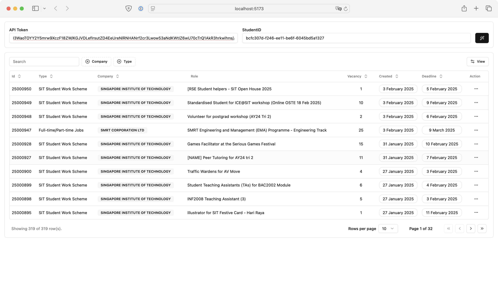

# ReadyTalent Job Listings App

A more accessible web application that fetches and displays job listings using unofficial and reversed ReadyTalent API.

## Features

- Fetch job listings from ReadyTalent API
- View detailed job information
- Responsive data table display
- Loading states and error handling

## Screenshot



## Usage

```bash
npm install
npm run dev
```

1. Log into readytalent and copy your API token and Student ID (not SIT Student Number)
2. Enter your API Token and Student ID in the input fields
3. Click the search button to fetch job listings

## Technologies Used

- React + TypeScript
- Vite
- Shadcn UI components
